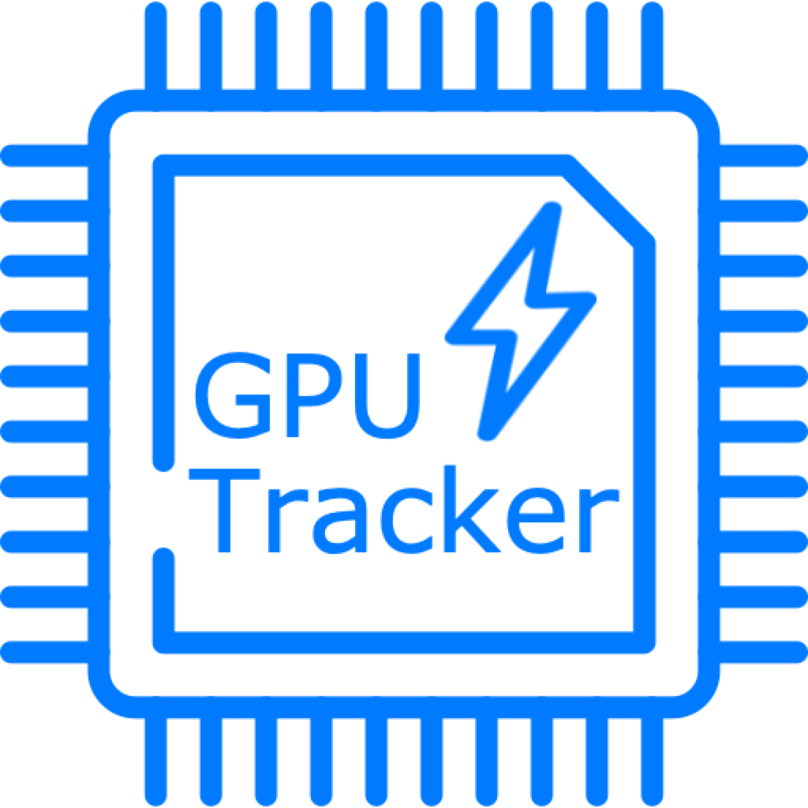

             
             <h1>GPU Tracker</h1>

A Swift-based project for iOS devices wich provides detailed information about released video game consoles.

The main goal of the project is to provide quick access to databases containing not only common information about consoles
but also detailed hardware specifications such as peripherals, motherboard components, revisions, and GPU/CPU variations. 

This app helps video game collectors and users quickly check the system in offline mode.

## Requirements

- iOS 15.5 or later
- Xcode 14.2 or later
- Swift 5.7 and later
- Package Dependencies: ⚠️ Realm 10.37.2 (Exact) 

